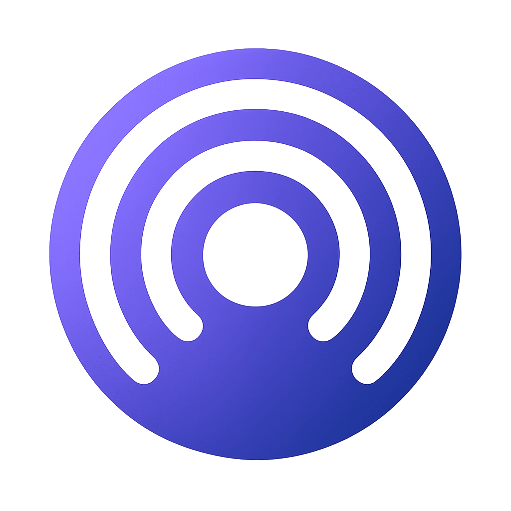

# MindSpace

Mobile app focused on mood tracking, guided meditation, and personal journaling.



## Description

MindSpace brings together personal wellness tools in a single app. The project includes features for tracking moods, reviewing basic metrics, completing meditation sessions, and saving journal entries.

## Main Features

### Mood Tracking

- Daily emotional state tracking
- Categorization using indicators such as energy, stress, and happiness
- Trend and pattern visualization
- Streak system

### Guided Meditation

- Meditation types such as mindfulness, breathing, and gratitude
- Multiple difficulty levels
- Configurable duration between 5 and 30 minutes
- Progress and statistics tracking

### Digital Journal

- Entries categorized by type
- Mood tags
- Search and filtering
- Writing prompts

### Analysis and Statistics

- Dashboard with key metrics
- Time-based trend charts
- Summaries of wellness patterns
- Achievements and streak system

## Design and UX

- Material Design 3 with a custom theme
- Gradients and a soft color palette
- Animations with Flutter Animate
- Interface designed for daily use
- Adaptive theme

## Technologies Used

- Flutter 3.8+
- Dart
- Provider
- Go Router
- Google Fonts
- Fl Chart
- SQLite
- Lottie

## Main Dependencies

```yaml
dependencies:
  flutter:
    sdk: flutter
  provider: ^6.1.2
  go_router: ^14.2.7
  google_fonts: ^6.2.1
  flutter_animate: ^4.5.0
  fl_chart: ^0.69.0
  sqflite: ^2.3.3+1
  shared_preferences: ^2.2.3
  lottie: ^3.1.2
  glassmorphism: ^3.0.0
```

## Installation and Setup

### Prerequisites

- Flutter SDK 3.8 or later
- Dart SDK 3.0 or later
- Android Studio or VS Code
- Android SDK for Android
- Xcode for iOS

### Installation Steps

1. Clone the repository

   ```bash
   git clone https://github.com/tu-usuario/mindspace-app.git
   cd mindspace-app
   ```

2. Install dependencies

   ```bash
   flutter pub get
   ```

3. Configure the application

- Update `applicationId` in `android/app/build.gradle.kts`
- Configure digital signing for release
- Customize icons and splash screen

4. Run the application

   ```bash
   flutter run
   ```

## Production Build

### Android (APK)

```bash
flutter build apk --release
```

### Android (AAB for Play Store)

```bash
flutter build appbundle --release
```

### iOS

```bash
flutter build ios --release
```

## Project Status

### Implemented

- [x] Base application architecture
- [x] Bottom navigation
- [x] Home screen with quick actions
- [x] Reusable widgets
- [x] Theme system
- [x] State management with Provider
- [x] Data models
- [x] Initial Play Store setup

### In Development

- [ ] Detailed meditation screens
- [ ] Full journal editor
- [ ] Advanced mood tracking
- [ ] Notification system
- [ ] Cloud sync
- [ ] Full offline mode

## Project Structure

```text
lib/
|-- constants/          # Colors, themes, and constants
|-- models/             # Data models
|-- providers/          # State management
|-- screens/            # Application screens
|-- widgets/            # Reusable widgets
|-- services/           # Services
`-- utils/              # Utilities and helpers
```

## Color Palette

- Primary: deep purple (`#6B46C1`) to soft lavender (`#9F7AEA`)
- Secondary: blue (`#3B82F6`) to teal (`#14B8A6`)
- Accents: orange (`#F59E0B`) and pink (`#EC4899`)
- Neutrals: grays for text and backgrounds

## Roadmap

### Version 1.1

- [ ] Guided meditations with audio
- [ ] Data export
- [ ] Customizable themes
- [ ] Desktop widgets

### Version 1.2

- [ ] Wearable integration
- [ ] Sleep analysis
- [ ] Community and sharing
- [ ] AI-powered personalized insights

### Version 2.0

- [ ] Cognitive behavioral therapy
- [ ] Personalized coaching
- [ ] Professional integration
- [ ] Virtual reality for meditation

## Contribution

Contributions can be submitted through pull requests:

1. Fork the project
2. Create a branch for your change
3. Make and commit your changes
4. Push the branch to the remote repository
5. Open a pull request

## License

This project is distributed under the MIT license. See `LICENSE` for more details.
